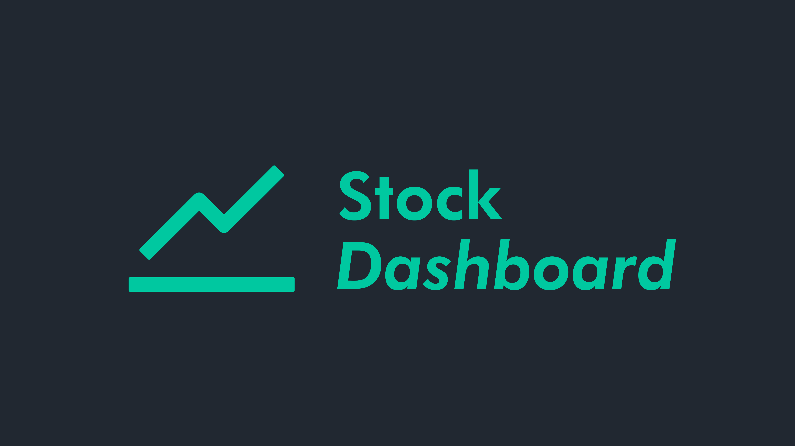
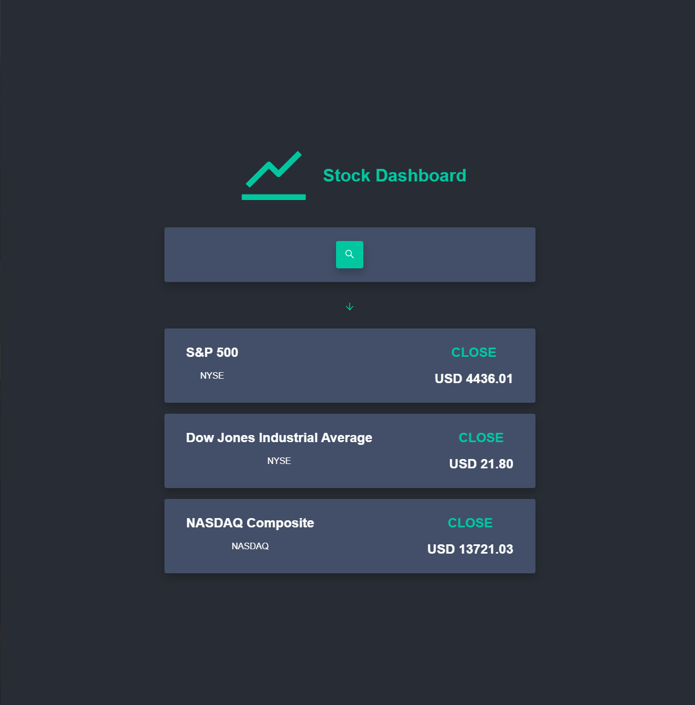
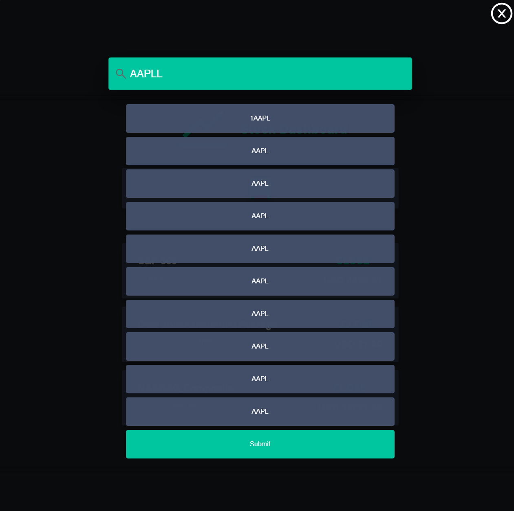
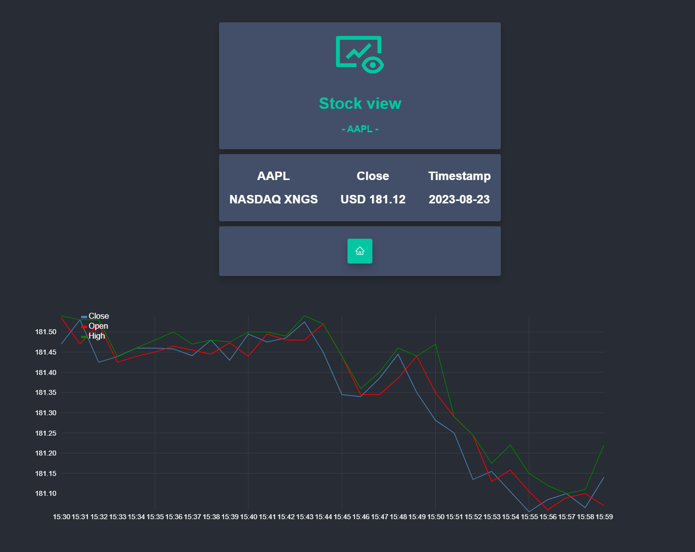
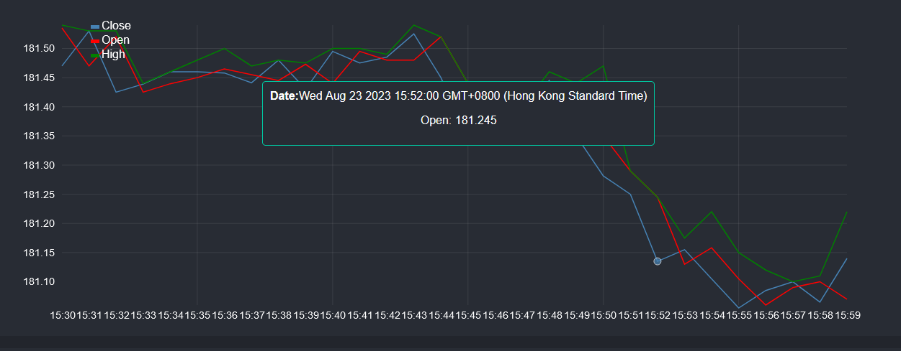

## Stock Dashboard

This is a dashboard for stock analysis, It is built with React and 12API.

## Features
- Lightweight, it just uses 12API for fetching data and that's it
- Responsive, it works on all devices
- Easy to setup, as all you need to do is change the API Key in the config.js file

## Screenshots

Home Screen


Search Screen


Stock View Screen


tooltip on hover


## How to use?

1. Clone the repo

2. Install dependencies

```bash
    npm i
```

3. Get your API Key from https://twelvedata.com/

4. Paste your api key in the config.js file in the src folder

```js
const API_KEY = "YOUR_API_KEY";
```

5. You are good to go

## Contributing

Contributions are always welcome! Please, let me know what changes you made and how it improves the app, as I am always looking to improve! :)